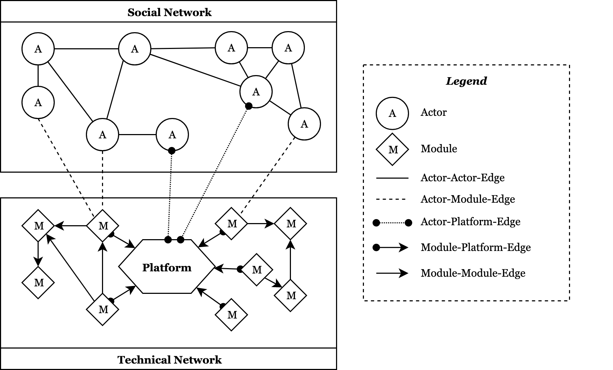

# Introduction

Digital ecosystems are a growing source of innovation, where capabilities shift from within an organization to third-party developers [@Parker2017; @Yoo2013; @Yoo2010a], which has led to an increasing research interest on the phenomenon of platform-based software ecosystems [@Jacobides2018]. The success of open source software [OSS; @Lerner2002] and the trend away from monolithic to platform-based software systems [@Hanseth2010] have created large-scale software ecosystems, which we refer to as *platform-based open source software ecosystems (POSSE)*. In this context, a platform is defined as "the extensible codebase of a software-based system that provides core functionality shared by the modules that interoperate with it and the interfaces through which they interoperate" [@Tiwana2010b]. Accordingly, the platform and its entirety of complementary modules form the platform's ecosystem [@Tiwana2010b]. Hence, POSSE are digital ecosystems consisting of digital artifacts [@Kallinikos2013] that are OSS modules [@Eck2016]. These modules interact with the digital ecosystem's platform core through standardized interfaces and add functionality or value to the digital platform [@deReuver2018; @Tiwana2010b]. This modular architecture of POSSE allows for the coordination of heterogeneous developers that contribute interdependent modules through an ecosystem [@Jacobides2018] in which interoperability with the platform core is ensured through the usage of the platform's interfaces [@Tiwana2015]. Developers make use of existing modules through a process of recombination and remixing when building new modules, which they then contribute to the ecosystem. By doing so, two distinct types of networks emerge. First, this process generates a *technical network of modules and their interdependencies*, which are connected due to technical dependencies between modules in the ecosystem [@MacCormack2006]. Second, developers form a *social network of actors and their relationships* by contributing their skill and time [@Roberts2006] when creating new modules or adding code to existing modules of the ecosystem. In doing so, they might add new technical dependencies to existing modules, which affects the network of interdependencies, or form new social structures by creating new collaborations or forming teams [@Hahn2008]. Due to this, we view POSSE as socio-technical systems comprised of the social network of the participating developers and the technical network of interdependencies of its complementary modules.

Previous research on the evolution of platform-based ecosystems has investigated module interdependencies and their effect on platform evolution, which showed that novel functionality relies on the introduction of new dependencies [@Hukal2017], and that the ecosystem coevolves with its modules [@Um2016]. These findings are closely related to studies that show how OSS is constructed and evolves through layering, whereby future development activities can build up on the current layer [@Howison2014]. However, current studies investigating the evolution and success of platform-based ecosystems mainly focus on the technical side of the ecosystem, even though the technology alone does not lead to innovation in such complex networks, which depend on diverse groups of actors with access to this technology and using it in innovative ways [@Boland2007]. In the context of OSS, for example, voluntary software developers form project teams that emerge based on the developers' social networks [@Hahn2008]. The success of POSSE therefore is not only related to its technology, but also to "the project production process and the broader social environment in which developers work" [@Singh2011, 814].

Despite the importance of both social and technical interactions, the direction and consequence of changes (e.g., symbiosis and coevolution of modules, or knowledge exchange amongst developers) of social networks (i.e., social interactions of contributors) or technical networks (i.e., technical interdependencies of modules) in POSSE have yet to be uncovered. An enhanced understanding of the relationship between the technical and social networks, and how they influence each other's structure, could explain the dynamics of ecosystem evolution and growth. This goes along with recent calls for rethinking the nature of socio-technical systems in information systems research, especially due to "novel arrangements emerging in the digital age" [@Winter2014, 264], including phenomena such as digital platforms and OSS. For example, the aspect of complex forms of socio-technical encapsulation and overlapping systems or platforms is seen as a central aspect of contemporary socio-technical systems [@Winter2014]. Accordingly, we ask:

> *"How do socio-technical dynamics in platform-based open source software ecosystems influence the ecosystem's growth and evolution?"*

To answer our research question, we propose to conduct a study of three of the most popular front-end development frameworks (i.e., Angular, React, and Vue) and their respective POSSEs. In doing so, we respond to calls for data-driven approaches to investigate ecosystem dynamics [@deReuver2018]. We aim to analyze both the technical and social networks of those ecosystems with digital trace data [@Berente2019] gathered from the projects' GitHub and npm repositories. For our analysis, we will primarily use network analysis techniques (i.e., cluster, temporal, and network motif analyses). This will help to uncover the underlying socio-technical dynamics leading to the evolution and growth of the digital ecosystems.

These findings will contribute to theory and practice in two important ways. First, we propose and develop a socio-technical approach for analyzing evolutionary dynamics in POSSE. Second, we will advance our understanding of the growth and success of POSSE and identify important predictors. Having insight into how social and technical networks (i.e., collaborators and dependencies) are interconnected, reveals interdependencies and enables conclusions on who drives which aspects in the development and ultimately the evolution of POSSE. Combined, this research therefore benefits both research and practice related to POSSE and digital platform ecosystems in general.

The remainder of this paper is organized as follows. First, we define and explain the concept of POSSE and the social and technical interdependencies in open source projects in general and in POSSE in particular. Second, the proposed research design is introduced including the description of our data collection and analysis. Third, we present our expected results as well as our roadmap until ICIS 2019. Fourth, we conclude with a discussion about potential challenges, risks, and our expected contributions.

# Theoretical Background

## Platform-based Open Source Software Ecosystems

With modern software systems changing from a monolithic to a platform-based design [@Hanseth2010], software is created "on top" of digital platforms, that is the "extensible codebase of a software-based system that provides core functionality shared by the modules that interoperate with it and the interfaces through which they interoperate" [@Tiwana2010b, 675]. When the platform orchestrator opens the digital platform for third-party developers, it transitions to a software ecosystem [@Bosch2009], which consists of the digital platform, its interfaces, complementary modules, and the developers [@Tiwana2013]. In software ecosystems, developers contribute their time, knowledge, and skill to increase the value of the ecosystem by participating in it through the contribution of modules [@Roberts2006], which are "add-on software subsystem that connect to the platform to add functionality to the platform" [@Tiwana2010b, 676]. In this scenario, the platform functions as a hub with the complementary modules as spokes connected through application programming interfaces (APIs) or other technical standards [@Jacobides2018]. This transformation is also evident in OSS, where the resulting platform-based open source software "incorporate principles from open source development as well as traditional engineering principles (e.g. modular system design)" [@Cataldo2010, 66]. Accordingly, we define *platform-based open source software ecosystems (POSSE)* as "a collection of digital artifacts \[i.e., modules\] that coevolve through mutual interference, and the social actors related to these artifacts that are linked by a common interest" [@Eck2016, 2].

The modular system design affords coordinating large numbers of developers that contribute interdependent modules through an ecosystem [@Jacobides2018] in which interoperability with the platform core is ensured through the usage of the platform's interfaces [@Tiwana2015]. Therefore, POSSE involve "a large and heterogeneous collection of stakeholders that need to collaborate effectively in order to produce successful outcomes" [@Cataldo2010, 65]. Hence, they strongly depend on the contributions of a number of third-party developers that build complementary modules, which add functionality to the digital ecosystem. By enabling contributions by external actors, digital ecosystems are seen as a growing source of innovation where capabilities shift to the outside of the organization [@Parker2017; @Yoo2013; @Yoo2010a]. This opens up POSSE for contributions from a wide range of developers and therefore raises the importance of understanding the dynamics between the social and technical aspects of the ecosystem.

## Socio-Technical Dynamics in Platform-based Open Source Ecosystems

OSS projects rely heavily on the communities surrounding these projects -- without the contributions of time and effort of highly motivated developers, OSS projects cannot exist [@Roberts2006]. In general, the success of the open source model has led to an increase in OSS projects and new ideas on how innovation should be managed [@Singh2011]. OSS projects do not always produce software targeted at end users, but at developers and this software is "designed to be reused and to provide functionality to other software projects" [@Haefliger2008, 180]. Boland et al. [-@Boland2007] make the point that technology (e.g., software) per se does not herald innovation in complex networks. Rather, diverse groups of actors with access to the technology are those putting their capabilities to innovative uses. In the context of OSS, voluntary software developers form project teams that emerge based on the developers' social networks [@Hahn2008]. The success of OSS projects therefore is not only related to technical characteristics, but also to "the project production process and the broader social environment in which developers work" [@Singh2011, 814]. OSS projects can therefore be seen as socio-technical systems.

Adopting a socio-technical view on POSSE, we conceptualize the socio-technical dynamics in POSSE by taking various relations between the social actors (i.e., developers) and technical artifacts (i.e., platform and modules) into account. By taking the social and technical network into account, various interactions between actors and artifacts are feasible, and potentially influence the evolutionary dynamics of the ecosystem. Whereby the social network consists of actor-actor relations and the technical network of artifact-artifact relations, we also consider actor-artefact relations between both networks. The relations of our conceptual socio-technical model of POSSE are shown in Figure 1. In this study, we treat the platform (i.e., the codebase of Angular, React, or Vue) as a black box, hence, we do not investigate the internal structure and modules of the platform. The focus of this study is on the interdependencies of the modules contributed by third-party developers to the platform's ecosystem.

In sum, POSSE are the intersection of effects relating to digital platforms, ecosystems, and OSS. This intersection, combined with the effects emerging from the intertwined relationship of social and technical aspects, are uncharted territory. By following the call of Winter et al. [-@Winter2014] to rethink socio-technical systems based on digitally induced changes, we aim at revealing the combination of the underlying social and technical forces in POSSE. The conclusions drawn from our results, will help in structuring, managing, and growing POSSE, based on our identification of patterns and drivers in successful POSSE. Ultimately, our study will positively affect the success and popularity of POSSE.

# Preliminary Research Design

## Research Method & Study Description

For this research project, we adopt a data-driven computational approach for theory development, following the recommendations for grounded theory methodology [@Berente2019] and guidelines for qualitative research with digital trace data [@Lindberg2020]. Here, we define digital trace data as "digital records of activities and events that involve information technologies" [@Berente2019, 51].

We selected the three ecosystems by following a theoretical sampling strategy. Looking for similar and established POSSE, we identified three suitable ecosystems: (1) Angular[^1] (https://angular.io/), (2) React (https://reactjs.org/), (3) and Vue (https://vuejs.org/). All ecosystems are currently among the most popular front-end-frameworks for web- or web-app-development [@StackOverflow2019]. Further, they are suitable as all three ecosystems share similarities: they are written in JavaScript or derivatives (i.e., TypeScript) and aim at providing a basis for web- or app-development. While their respective implementations might differ, the ecosystems also remain similar due to their shared intent (i.e., front-end frameworks). Table 1 provides an overview of all three ecosystems.

|                                       | ***Angular***  | ***React*** |   ***Vue***   |
| ------------------------------------: | :------------: | :---------: | :-----------: |
|                     *Initial Release* | September 2016 |  May 2013   | February 2014 |
|                             *Sponsor* |     Google     |  Facebook   |      --       |
|                        *Contributors* |      904       |    1,290    |      270      |
| *Weekly Downloads (as of April 2019)* |    405,811     |  4,588,442  |    894,590    |
|      *Number of Modules in Ecosystem* |     14,241     |   40,225    |    12,393     |

Table: Overview of Selected Ecosystems

## Data Collection

To collect data on our three ecosystems, we utilize two main data sources: *GitHub* (https://github.com), which all three cases use as source code repository, and *npm* (https://npmjs.com), which all three cases use as release management and distribution tool. From GitHub, we are able to collect detailed information about the collaborators, codebase, and development process for each module. From npm, we are able to collect detailed information about the releases related to the respective ecosystem. To identify modules for each of the three ecosystems, we utilize the search API offered by the npm registry. We are able to identify every publicly available module for each of the ecosystems by searching for tags such as "angular", "react", or "vue". Including variants, we are thereby able to identify all needed modules. As of August 2019, we have collected the data of 58,548 modules over all three ecosystems. Table 2 provides an overview of the collected data from npm. Combining the data from GitHub and npm, we are able to aggregate measures such as the number of modules available in an ecosystem, the lines of code affected by a release, the lines of code per contributor per release, or the lines of code per download per day, giving us a wide range of additional measures to interpret and explain the evolution and growth [cf. @Lindberg2020]. Including temporal data (e.g., quarterly downloads), we are able to set these measurements into context and investigate the ecosystem's evolution and growth over time.

| ***Date***     | ***Description***                                                                                                    |
| :------------- | -------------------------------------------------------------------------------------------------------------------- |
| *Description*  | Short description of modules purpose and functionality.                                                              |
| *Contributors* | List of contributors mentioned with their npm username.                                                              |
| *Versions*     | History of releases, including all dependencies of each version, author, keywords, and release date.                 |
| *Dependencies* | List of module dependencies, including dependencies for development and required module version for each dependency. |
| *Keywords*     | List of keywords, describing the package, it's intended environment, and platforms.                                  |

Table: Excerpt of Collected Data per Module from npm

## Data Analysis

In a first step, based on the collected data on the social relationships as well as the technical dependencies of the modules, we are going to generate directed graphs for the subsequent network analysis. In the next step, we will create two separate networks for both the social and technical aspects of the ecosystems. For the *social network*, we will construct an actor-actor network based on the relationships of the ecosystem's developers (i.e., shared contributions to modules and/or other social links based on GitHub follows). For the *technical network*, we will construct artefact-artefact networks representing the module dependencies. In addition, to take the socio-technical aspect into account, we will model the actor-artefact interconnections (i.e., the actor in the social network is linked to its artefacts in the technical network). Table 3 describes the operationalization of each edge type of the networks in line with our conceptual framework (see Figure 1).

| ***Edge Type***   | ***Description***                                                | ***Operationalization***                                                   |
| :---------------- | :--------------------------------------------------------------- | :------------------------------------------------------------------------- |
| *Actor-Actor*     | Both actors contributed to a common module of the ecosystem.     | Both actors are listed as contributors in module's metadata.               |
| *Actor-Module*    | Actor contributed to the specific module of the ecosystem.       | Actor is listed as a contributor in the specific module's metadata.        |
| *Actor-Platform*  | Actor contributed to the platform's core module.                 | Actor is listed as a contributor in the platform's core module metadata.   |
| *Module-Module*   | Module has the other module included as a technical dependency.  | Module is listed as a dependency in the other module's metadata.           |
| *Module-Platform* | Module has the platform core included as a technical dependency. | Platform's core module is listed as a dependency in the module's metadata. |

Table: Operationalization of Edge Types

In line with our research question, the main goal of the network analysis is to identify socio-technical dynamics in the ecosystems and explain the ecosystems' evolution. To achieve this goal, we will apply multiple network analysis techniques: (1) cluster analysis, (2) temporal analysis, and (3) motif analysis. First, for our *cluster analysis*, we will use the *Density-Based Spatial Clustering of Applications with Noise (DBSCAN)* algorithm introduced by Ester et al. [-@Ester1996], which identifies clusters of arbitrary shape, accounts for outliers in the data, and does not need a priori specification of the number of clusters. These clusters of actors or modules might provide insight into underlying similarities and the clusters' evolution over time (e.g., different layers of modules or different use cases, such as middleware and front-end modules). Second, the *temporal analysis* of the networks and their clusters allows us to identify changes over time and potential key events that lead to changes in the networks. In doing so, we can analyze the patterns that led to the evolution and growth of the ecosystems and are able to identify effects on the micro (e.g., the movement of actors between and across modules) and the macro (e.g., the distribution and growth of module clusters) level [cf. @Lindberg2020]. Third, the *motif analysis* identifies "recurring, significant patterns of interconnections" [@Milo2002, 824]. Thus, a network motif can be described as a repeating sub-graph in a network or across networks. By detecting network motifs, we aim to identify patterns that might hint at underlying dynamics between the modules (technical network) and/or the developers (social network) not accounted for in the cluster analysis.

The results of the applied network analysis techniques will then be used to derive explanations for the evolution and growth of the ecosystem. In this specific context, we define growth as a combination of multiple indicators. First, we will utilize the number of downloads per module as an indicator for its popularity. Second, we will include the number of ecosystems actors (i.e., developers) as an indicator for the growth of the ecosystem [e.g., @Setia2012]. Utilizing this multi-indicator approach enables us to observe an ecosystem's growth on multiple dimensions [cf. @Lindberg2020]. Third, we analyze the rate at which modules are added to the ecosystem, which not only is an indicator for its growth, but also for the rate of innovation in the ecosystem [@Parker2017]. Fourth, to measure the evolution of a particular module, we will analyze the rate at which it is upgraded [@Tiwana2015]. With the help of correlation analysis or regression analysis, we plan then on demonstrating which of the above-mentioned measures regarding social or technical networks predicts growth. Especially by including a temporal dimension, we are able to identify cause and effect more clearly [cf. @Lindberg2020].

# Expected Results

Due to the exploratory nature of this study, we remain open to different results and different explanations [cf. @Lindberg2020]. However, based on existing work, we have some prior assumptions of what we expect to see. First, we expect the developers' social networks to affect the technical network of the ecosystem. We expect this to occur because developers bring their own technical experience and knowledge into the projects they are working on, which includes integrating modules they have used before in other projects. This means that if developers collaborate on different modules together, they might use the same dependencies across multiple modules. Hence, these choices made by one actor might create trajectories for the remaining actors [@Boland2007].

> *Proposition 1: The technical dependencies of a module are influenced by the social relations of participating actors.*

Second, we also expect technical network to have an effect on the social network. For instance, developers using a particular module might seek help from its developer, report a bug, or request additional functionality. This connection might lead to new social relations in the future. For example, both actors might collaborate on new modules, merge their existing modules due to similar functionalities, or form new clusters of actors.

> *Proposition 2: The social relations of participating actors are influenced by the technical dependencies of contributed modules.*

Third, based on the shown interdependent relationship between social actors and technical dependencies, we expect to see a cyclical interaction between both networks.

> *Proposition 3: The technical dependencies of a module and the social relations of associated actors form a cyclical interaction over time.*

Fourth, we expect the growth of the social network to correlate with the growth of the technical network, as a higher number of available modules increases the attractiveness of the ecosystem for developers [@Parker2017]. This is because more modules might increase reuse and the chance to find a suitable module for a problem at hand.

> *Proposition 4: The growth of the social and technical networks is correlated.*

Fifth, even though the modules themselves are independent from the codebase of the platform core, they use functionality provided by other modules, which results in a dependency on the module it draws functionality from. Therefore, the introduction of a new module might lead to a new cluster of modules that are enabled by the newly provided functionality. This goes in line with recent studies that show that OSS is constructed and evolves through layers of changes on which future development activities can build on [@Howison2014]. According to this theory of superposition, a software layer only uses "what is already there" [@Howison2014, 34]. We believe that a similar mechanism is also observable in POSSE and explains its evolution.

> *Proposition 5: The introduction of novel functionality provided by additional modules enables ecosystem evolution and generates module clusters depending on the additional modules.*

# Expected Contribution

This study proposes a data-driven approach to uncover socio-technical dynamics in POSSE. Thereby, we expect to contribute to the research on digital ecosystems as well as open source software as follows. Having insight into how social and technical networks are interconnected reveals interdependencies and allows for conclusions on who drives which aspects in the development, evolution, and growth of POSSE. Being able to explain why socio-technical dynamics lead to differences in growth and evolution enables actors (e.g., platform owner, developers) participating in such ecosystems to take corrective actions. In addition, we contribute to the growing stream of research analyzing digital platforms and their ecosystems by proposing a methodological approach for analyzing the socio-technical dynamics of these phenomena using digital trace data, responding to the call for more data-driven approaches to investigate ecosystem dynamics [@deReuver2018]. Further, our research offers an avenue for future research to investigate the evolution of POSSE in more detail. Since firms are increasingly choosing "orchestration over production" when it comes to software code [@Parker2017], we contribute to research on a growing phenomenon. Given the increasing shift towards open source models in software development and the benefits of platform-based architectures, insights on the factors influencing their success, evolvability, and ability to create innovative outcomes can help researchers and practitioners alike to increase the understanding of this phenomenon.

# Further Approach

Until the International Conference on Information Systems in December 2019, we plan to accomplish multiple steps towards our final goal. First, we plan to have completed our data collection (i.e., have collected all data from GitHub and npm for all three ecosystems). This step includes cross referencing data across GitHub and npm (e.g., releases from npm and commits included in this commit from GitHub). As the data crawler has already been written, we expect this step to be completed around July 2019. Second, we plan to create an internal research memo on initial observations from the collected data. This step is important to have a clearer understanding of the structure of the data and to prepare for detailed quantitative analysis. We expect this step to be completed by October 2019. Third, we plan on conducting a detailed quantitative analysis before December 2019, which contents have been laid out in the previous section. Thus, we aim to present preliminary results of the network analysis and provide first explanations for the influence of socio-technical dynamics on POSSE's evolution.

# References {.unnumbered}

[^1]:

  Note: Angular needs to be differentiated from AngularJS, as Angular has
  emerged from a complete rewrite of AngularJS.